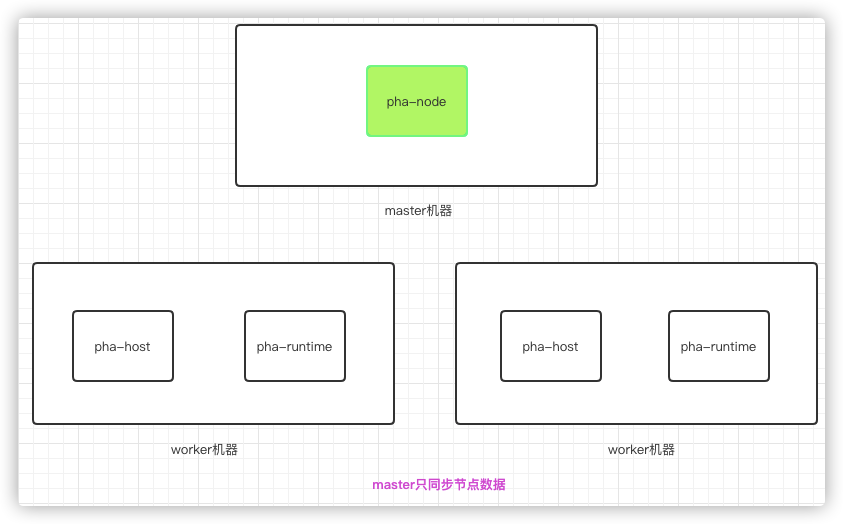
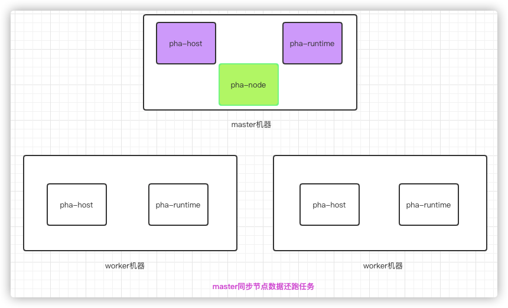

# phala 挖矿方案

- [下载和安装](#-----)
- [khala集群方式部署](./khala/README.md)
- [khala worker 批量部署](./khala/batch/worker/README.md)
- [单机启动](#----)
- [集群启动](#----)
  * [方式一: master机器只同步数据](#-----master-------)
  * [方式二: master机器同步节点数据还跑任务](#-----master------------)
- [可能用到运维操作](#--------)
  * [清理 docker 容器](#---docker---)
  * [查看矿机状态](#------)
  * [日志](#--)
- [注意事项](#----)
- [工具](#--)
  * [批量生产账号](#------)
- [参考](#--)

如果该项目对你有用，你是否愿意打赏呢？:heart_eyes:

* *BTC*: 3PWeE9gcounVUxxGjA4JrWg4EDiTmjmpNU
* *ETH*: 0x1e42727934d14B180863346B108C612fD4a9eA99
* *DOT*: 15Y7HvAvPyXWMxDsujMrneEXmFyqXURmBGi5BTWfcFgWAbV8
* *KSM*: GErd9vicRMBg4ppzzgASLxoj5FiRYMituXevGupWDvKVey8
* *NEAR*: bingryan.near

### 下载和安装

```shell
git clone https://github.com/big-miner/phala-miner.git
cd phala-miner && sudo chmod -R 755 * && sudo ./install.sh
```

### 单机启动

修改`standalone/deploy.yml`中  *NODE_NAME(节点名字)* 和 *MNEMONIC(Controllor账号助记词)* 两个参数

```diff
  phala-standalone-node:
    ...
+      - NODE_NAME='节点名字'
      
  phala-standalone-phost:
        ...
+      - MNEMONIC=online equal assist riot forward xxx enjoy spawn noise damage xxx xxx (Controllor账号助记词)
        ...
```

运行下面，到此完成

```shell
sudo docker-compose -f standalone/deploy.yml up -d
```

### 集群启动

#### 方式一: master机器只同步数据

<p align="center">
  
</p>


*master机器*

```shell
sudo docker-compose -f cluster/master.yml up -d
```

tips: 9933,9944,30333 防火墙关闭

```shell
sudo ufw allow 9933
sudo ufw allow 9944
sudo ufw allow 30333
```
*worker机器*

修改`cluster/worker.yml`中  *master_ip(master机器的对外IP)* 和 *MNEMONIC(Controllor账号助记词)* 两个参数

```diff

  phala-worker-phost:
+      - PHALA_NODE_WS_ENDPOINT=ws://{master_ip}:9944
+      - MNEMONIC={Controllor账号助记词}
        ...
```

运行下面，到此完成

```shell
sudo docker-compose -f cluster/worker.yml up -d
```


#### 方式二: master机器同步节点数据还跑任务

<p align="center">
  
</p>


*master机器*

本质和 standalone 模式一样

修改`standalone/deploy.yml`中  *NODE_NAME(节点名字)* 和 *MNEMONIC(Controllor账号助记词)* 两个参数

```diff
  phala-standalone-node:
    ...
+      - NODE_NAME='节点名字'
      
  phala-standalone-phost:
        ...
+      - MNEMONIC={Controllor账号助记词}
        ...
```

运行下面，到此完成

```shell
sudo docker-compose -f standalone/deploy.yml up -d
```

*worker机器*

修改`cluster/worker.yml`中  *master_ip(master机器的对外IP)* 和 *MNEMONIC(Controllor账号助记词)* 两个参数

```diff

  phala-worker-phost:
+      - PHALA_NODE_WS_ENDPOINT=ws://{master_ip}:9944
+      - MNEMONIC={Controllor账号助记词}
        ...
```

运行下面，到此完成

```shell
sudo docker-compose -f cluster/worker.yml up -d
```

### 可能用到运维操作

#### 清理 docker 容器

```shell
sudo docker stop $(sudo docker ps -q) & sudo docker rm $(sudo docker ps -aq)
```

#### 查看矿机状态

```shell
sudo phala status
```

#### 日志

```shell
sudo phala logs node  # 或： sudo docker logs phala-node
sudo phala logs pruntime # 或： sudo docker logs phala-pruntime
sudo phala logs phost  # 或： sudo docker logs phala-phost
 
```

### 注意事项

```diff
+ 默认数据是存储在 /opt 目录下，挂载硬盘请挂载这个目录,或者修改自行修改
+ SGX 驱动 和 DCAP 驱动 两种方式，默认是DCAP 驱动，如果是SGX 驱动请到cluster/standalone目录配置文件中进行修改
```

### 工具

#### 批量生产账号

[波卡批量账号生成](https://github.com/big-miner/miner-key)

### 参考

[官方单节点脚本](https://github.com/Phala-Network/solo-mining-scripts)

[phala wiki](https://www.yuque.com/books/share/da4b715a-83cd-43cb-b556-3cf891ec0164)